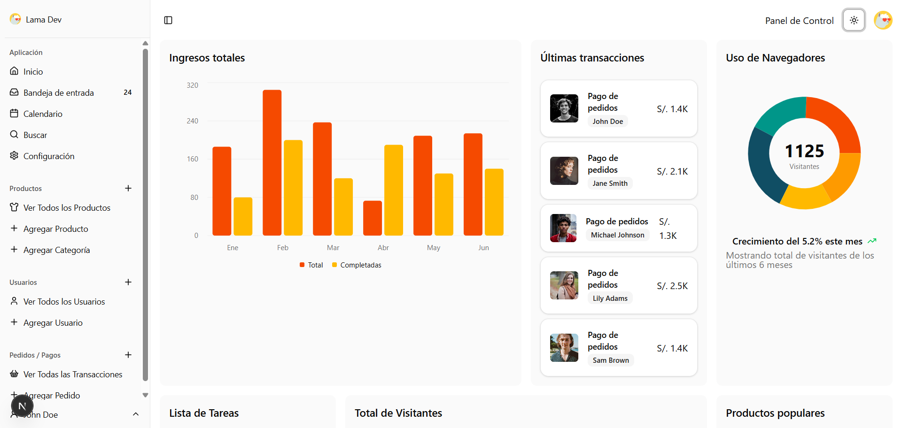

# 👔 TrendLama · Moda con Estilo 🛍️

## 🎯 Demos en Vivo

### Panel de Administración
[](https://trend-lama-admin.vercel.app/)

### Tienda Online
[](https://trend-lama-client.vercel.app/)

---

Bienvenido a **TrendLama**, tu plataforma de e-commerce moderna para descubrir las últimas tendencias en moda.
Creemos en la **elegancia, la calidad y la experiencia de usuario** como pilares fundamentales para ofrecer la mejor experiencia de compra online.

Con un diseño intuitivo, panel de administración completo y una experiencia de cliente fluida, **TrendLama** está pensado para revolucionar la forma en que compras moda en línea. 🚀

---

## 🌟 Características Principales

### 👨‍💼 Panel de Administración (Admin)
- 📊 **Dashboard interactivo** con gráficos y estadísticas en tiempo real
- 👥 **Gestión completa de usuarios** con tabla de datos avanzada
- 🛍️ **Control de productos** con imágenes, colores, tallas y descripciones
- 💳 **Seguimiento de pedidos y pagos** con estados actualizables
- 📁 **Sistema de categorías** para organizar productos
- 🌓 **Modo claro/oscuro** para personalizar la interfaz
- 📱 **Sidebar colapsable** optimizado para cualquier dispositivo
- ✅ **Lista de tareas (Todo List)** con calendario integrado

### 🛒 Tienda Online (Client)
- 🏪 **Catálogo de productos** con filtros y búsqueda avanzada
- 🎨 **Selector de colores y tallas** interactivo
- 🛒 **Carrito de compras** con gestión de productos
- 💰 **Proceso de pago** seguro y optimizado
- 👤 **Perfil de usuario** personalizable
- 📱 **Diseño responsive** adaptado a todos los dispositivos
- ⚡ **Carga rápida** gracias a Next.js 15

---

## ❓ ¿Por qué TrendLama?

El nombre **TrendLama** combina:

- **Trend** = Las últimas tendencias y moda actual
- **Lama** = Símbolo de elegancia, calma y distinción

Nuestro objetivo es **ofrecer una experiencia de compra excepcional** con productos de calidad y una plataforma moderna, rápida y fácil de usar.

---

## 🛠️ Tecnologías Utilizadas 👨‍💻

| HTML | CSS | JavaScript | React | TypeScript | Tailwind CSS | Next.js | Node.js | Shadcn/ui |
|------|-----|------------|--------|-------------|---------------|---------|---------|-----------|
|  |  |  |  |  |  |  |  |  |

### Librerías Adicionales:
- **Recharts** - Gráficos interactivos y visualización de datos
- **TanStack Table** - Tablas de datos avanzadas con ordenamiento y filtrado
- **React Hook Form** - Gestión de formularios con validación
- **Zod** - Validación de esquemas TypeScript-first
- **Lucide React** - Iconos modernos y personalizables
- **date-fns** - Manipulación y formateo de fechas

---

## 📁 Estructura del Proyecto
```
trend-lama/
├── admin/              # Panel de administración
│   ├── public/         # Archivos estáticos (imágenes, iconos)
│   └── src/
│       ├── app/        # Páginas y rutas de Next.js
│       ├── components/ # Componentes reutilizables del admin
│       ├── hooks/      # Custom hooks de React
│       └── lib/        # Utilidades y configuración
│
└── client/             # Tienda online
    ├── public/         # Archivos estáticos (imágenes de productos)
    └── src/
        ├── app/        # Páginas de la tienda
        ├── components/ # Componentes del cliente
        ├── data/       # Datos de productos y categorías
        ├── stores/     # Estado global (Zustand)
        └── types.ts    # Definiciones de tipos TypeScript
```

---

## 🚀 Instalación y Uso Local

### Panel de Administración (Admin)

1. **Clona el repositorio:**
   ```bash
   git clone https://github.com/carlossilvadev10/trend-lama.git
   ```

2. **Entra en el directorio del admin:**
   ```bash
   cd trend-lama/admin
   ```

3. **Instala las dependencias:**
   ```bash
   npm install
   ```

4. **Ejecuta el servidor de desarrollo:**
   ```bash
   npm run dev
   ```

5. **Abre tu navegador:**
   ```
   http://localhost:3000
   ```

### Tienda Online (Client)

1. **Entra en el directorio del cliente:**
   ```bash
   cd trend-lama/client
   ```

2. **Instala las dependencias:**
   ```bash
   npm install
   ```

3. **Ejecuta el servidor de desarrollo:**
   ```bash
   npm run dev
   ```

4. **Abre tu navegador:**
   ```
   http://localhost:3001
   ```

---


## 📩 Contacto

Si tienes alguna pregunta o sugerencia, puedes encontrarme en:

- 🌐 [Mi GitHub](https://github.com/carlossilvadev10)
- 📧 Email: [carlos.esilva1007@gmail.com](mailto:carlos.esilva1007@gmail.com)
- 💼 [Mi LinkedIn](https://www.linkedin.com/in/carlos-eduardo-silva-bustamante-b6084528b?utm_source=share&utm_campaign=share_via&utm_content=profile&utm_medium=android_app)

---

💡 **TrendLama** es más que una tienda online: Es una **experiencia de compra moderna** que combina **tecnología de punta** con **diseño elegante** para ofrecerte lo mejor en moda digital. 🦙✨